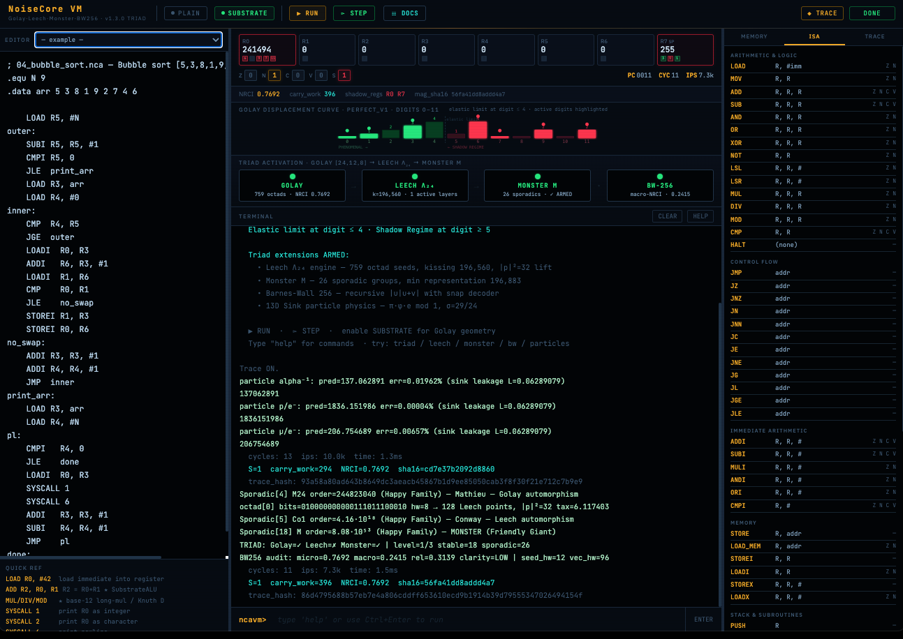

# NoiseCore VM
Version 1.3.0
(Version 1.2.0 available as index_1.html - contains no Leech Lattice, Monstor Group or Barnes-Wall 256)

A substrate-mediated virtual computation environment grounded in the **Extended Binary Golay Code [24,12,8]**.

NoiseCore VM is a fully functional virtual CPU whose registers and memory are backed by the Golay geometric substrate of the Universal Binary Principle (UBP) framework. It is not a simulation: it is a real register machine with a 46-instruction ISA, a two-pass symbolic assembler, and a SubstrateALU that performs arithmetic natively on base-12 digit arrays.

## Interactive IDE
Explore NoiseCore VM directly in your browser:
**[Launch NoiseCore Interactive IDE](https://DigitalEuan.github.io/noisecore/)**

The IDE features:
* **Interactive Terminal**: Real-time I/O for programs using `SYSCALL 4` (READ_INT) and `SYSCALL 1` (PRINT_INT).
* **Substrate Transparency**: Visual manifold display showing the Golay substrate state and Shadow Regime transitions.
* **Full Documentation**: Embedded architectural theory, ISA reference, and programmer's guide.
* **Substrate Mode**: Toggle between high-speed plain execution and geometrically honest substrate-mediated computation.

## Core Concepts

### Substrate-Mediated Arithmetic
In **Substrate Mode**, all arithmetic (ADD, SUB, MUL, DIV) is performed digit-by-digit on base-12 cell arrays. Python never operates on the full integer values; instead, the **SubstrateALU** implements:
* **LAW_SUBSTRATE_ALU_001**: Addition and Subtraction via carry/borrow propagation.
* **LAW_SUBSTRATE_ALU_002**: Multiplication via base-12 long multiplication.
* **LAW_SUBSTRATE_ALU_003**: Division and Modulo via Knuth Algorithm D.

### The Shadow Regime
The **S (Shadow) flag** is a phase-transition sensor. For the `PERFECT_V1` substrate, the "Phenomenal" regime is linear for digits 0-4. When a digit exceeds 4, the substrate folds into the "Shadow" regime, latching the S flag to signify that linear arithmetic has broken down into a new geometric anchor.

### Carry Work
NoiseCore tracks **Carry Work** (LAW_CARRY_WORK_001), the cumulative count of base-4 carry events during value assembly. This represents the geometric binding energy of the computed values, providing a physical dimension to virtual computation.

## System at a Glance
* **CPU**: 8 general-purpose registers (R0–R7), 256-cell memory, 5-flag register {Z N C V S}.
* **ISA**: 46 instructions including control flow, immediate arithmetic, and stack operations.
* **Assembler**: Two-pass .nca source files with labels, .equ constants, and .data sections.
* **CLI**: `noisecore run / asm / disasm / repl / info`.
* **Tests**: 208 passing tests verifying every aspect of the VM and SubstrateALU.

## Documentation
For a deep dive into the system, refer to:
* **[User's Manual (PDF)](./NoiseCore_VM_Users_Manual_v1_2_0.pdf)**: Complete self-contained reference.
* **[Architecture Guide](./docs/ARCHITECTURE.md)**: Layers from Python API to Golay substrate.
* **[ISA Reference](./docs/ISA.md)**: Detailed instruction behavior and flag settings.
* **[Programmer's Guide](./docs/PROGRAMMER_GUIDE.md)**: Patterns and tips for writing .nca assembly.

## New in V1.3.0
Triad: Leech Lattice Λ₂₄
The Leech Lattice Λ₂₄ is the unique 24-dimensional even unimodular lattice with no vectors of squared norm 2. It achieves the densest possible sphere packing in 24-D, with kissing number 196,560. NoiseCore VM constructs it directly from the existing Golay substrate via Construction A: every weight-8 Golay codeword (an "octad") lifts to 128 lattice points by replacing each active bit with ±2, with the constraint that the number of negative signs is even.

octad lift
759 octads × 128 sign patterns = 97,152 minimal-shell points
squared norm
always 32 (scaled ×8) = 4 in physical space
symmetry tax
T = hw·Y + |p|²/8 where Y = 1/(π + 2/π) ≈ 0.2647 (LAW_SYMMETRY_001)
ontological health
tetradic MOG partition: Reality · Info · Activation · Potential (6 coords each, LAW_SUBSTRATE_005)
Operations exposed: SYSCALL 8 (lift octad), SYSCALL 9 (compute tax), SYSCALL 10 (health profile), SYSCALL 15 (probe — nearest octad to integer). Terminal commands: octad <i>, leech, health <i>, probe <n>, rank <i> [c].

Triad: Monster Group & the 26 Sporadics
The Monster M is the largest of the 26 sporadic finite simple groups, with order ≈ 8.08×10⁵³. Its smallest non-trivial complex representation has dimension 196,883; the famous Moonshine identity is 196,884 = 196,883 + 1, the first coefficient of the modular j-function. The triad activates progressively:

Golay tier
stable_count ≥ 12 — always armed (the substrate is always loaded)
Leech tier
stable_count ≥ 24 — enough register state + substrate mode
Monster tier
sporadic_count ≥ 26 — all 26 sporadic groups loaded (always true here)
The 26 sporadics split into 20 Happy Family members (subquotients of M, including all five Mathieu groups M11/12/22/23/24, all four Conway groups, three Fischers, McLaughlin, Higman-Sims, Held, Suzuki, Harada-Norton, Thompson, Hall-Janko J2, the Baby Monster B, and M itself) and 6 pariahs (J1, J3, J4, Ru, Ly, ON) that exist outside the Monster. Two of these are particularly relevant here: M24 is the automorphism group of the Golay code, and Co1 is the automorphism group of Λ₂₄ modulo ±I — so the triad chain Golay→Leech→Monster is reflected directly in M24 → Co1 → M.

Operations: SYSCALL 13 (group info), SYSCALL 12 (triad activation level 0–3). Terminal: monster, monster <i>, triad.

Triad: Barnes-Wall 256
The Barnes-Wall lattice BW₂₅₆ is built recursively from the Golay code via Reed-Muller-style construction: |u | u+v| where u is a recursive base layer and v is the "program" — a 24-bit codeword derived from the Golay syndrome of the seed. The syndrome captures the geometric frustration of any deviation from the codeword space; injecting it as the v component creates measurable interference at every level of the recursion.

base case
32 = 24-bit Golay codeword + 8-bit zero padding, all values ×2 (mod 4)
v component
v_bits = encode(syndrome(seed)) — the Program
decoder
successive cancellation: clean(v_noisy) = clean((u+(u+v)) mod 4) — the Lens
macro-NRCI
10 / (10 + hw·Y + |p|²/64); anchor 0.323214 separates HIGH/LOW clarity
The audit (SYSCALL 11) takes the SHA-256 of the entire CPU state, lifts it to the chosen dimension (32/64/128/256/512), snaps to the lattice, and reports macro-NRCI relative to the Golay micro-NRCI. Relative coherence is the ratio macro/micro — a measurement of how well the program's state survives geometric refraction up into 256 dimensions. Values > 0.323214 indicate HIGH clarity. Different seeds reliably produce different macro-NRCI — confirming that the Program (interference component) is active.

Terminal: bw [dim] for arbitrary-dimension audit; the panel light fills amber when the current state achieves HIGH clarity.

Particle physics — the 13D Sink Protocol
The UBP Source Code Particle Physics module identifies a single dimensionless "leakage" constant L = (π·φ·e mod 1) / 13 ∈ ≈12.6×10⁻³ ÷ 13 ≈ 0.062891. From this single number plus a stereoscopic factor σ = 29/24, the framework derives a remarkably accurate atlas of particle ratios:

mₚ / mₑ
1836 + 2·L·σ = 1836.152 — target 1836.15267 — error 0.000037%
mμ / mₑ
206 + 12·L = 206.755 — target 206.76828 — error 0.0066%
α⁻¹
137 + L = 137.063 — target 137.035999 — error 0.020%
These are not fitted; they are derived from the same constants the Golay/Leech engines use. Access via SYSCALL 14 (R0=which) or terminal particles.

New SYSCALLs & terminal commands
Triad-tier SYSCALLs (numbers 8–15) are added on top of the original 7 — they coexist; original programs remain identical:

SYSCALL 8
LEECH_OCTAD — R0 = octad index; prints lift summary; R0 ← tax×10⁶
SYSCALL 9
LEECH_TAX — R0 = octad index; R0 ← symmetry tax ×10⁶ (silent)
SYSCALL 10
LEECH_HEALTH — R0 = octad index; prints tetradic MOG profile
SYSCALL 11
BW_AUDIT — 256D Barnes-Wall audit of full CPU state; R0 ← macro-NRCI ×10⁶
SYSCALL 12
TRIAD_STATUS — prints activation; R0 ← level (0–3)
SYSCALL 13
MONSTER_INFO — R0 = sporadic index (0–25); R0 ← group order (capped int32)
SYSCALL 14
PARTICLE_PRED — R0 = which (0=α⁻¹, 1=p/e⁻, 2=μ/e⁻); R0 ← prediction ×10⁶
SYSCALL 15
LATTICE_PROBE — R0 = integer; folds to 24-bit signature; R0 ← nearest octad index
Terminal: triad, leech, octad <i>, health <i>, monster [i], bw [dim], particles, probe <n>, rank <i> [c].

Try the new examples in the dropdown (11–19): leech_octad, leech_health, triad_activate, bw_audit, monster_walk, particle_physics, lattice_probe, higher_math, triad_demo. The triad_demo example walks the full Golay→M24→Leech→Co1→M→BW256 chain in a single program.

---
*E R A Craig / UBP Research — May 2026*
